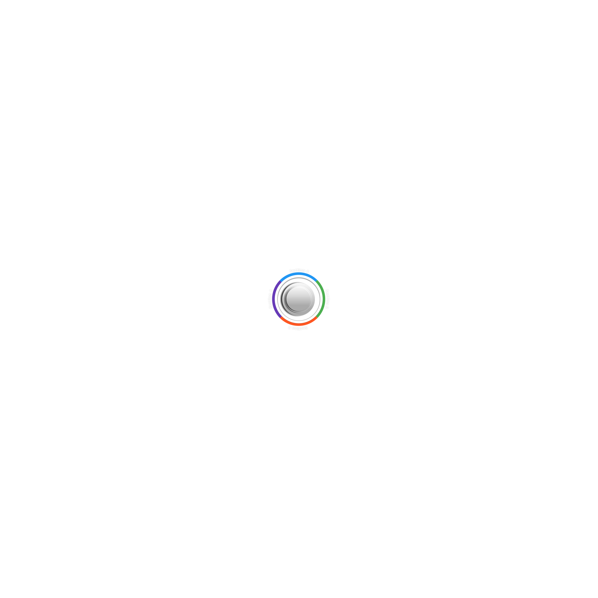

# jQuery.rotatingSlideshow
Simple jQuery plugin that allows you to create unique, but limited slideshow layout. It is design only to contain 4 slides and it colors and images can be adjusted by changing the .psd files included into project.

## Demo
Check out the demo example [here](http://alexmicic.github.io/jQuery.rotatingSlideshow.demo/).

## Dependencies
The plugin requires jQuery 1.9 or higher.

## Installation
To start using the plugin, simply include css file in the ```head``` section then add necessary ```html``` code and script file somewhere after jQuery library, preferably at the bottom of the page, like on the example below: 
```html
<!DOCTYPE html>
<html>
  <head>
    <!-- css -->
    <link href="~/jquery.rotatingSlideshow.css" rel="stylesheet" />
  </head>
  <body>
    <div class="rotating-slideshow">
        <div id="slider-main" data-position="1" data-deg="0">
            <div id="slider-btns" class="button">
                <a id="pos1" href="#" class="pos1" data-position="1"></a>
                <a id="pos2" href="#" class="pos2" data-position="4"></a>
                <a id="pos3" href="#" class="pos3" data-position="3"></a>
                <a id="pos4" href="#" class="pos4" data-position="2"></a>
            </div>
            <div class="slider-overlay">
                <div class="active" data-position="1">
                	<h3>Different</h3>
                  <p>Optional text goes here</p>
                </div>
                <div data-position="2">
                	<h3>Creative</h3>
                  <p>Optional text goes here</p>
                </div>
                <div data-position="3">
                	<h3>Fancy</h3>
                  <p>Optional text goes here</p>
                </div>
                <div data-position="4">
                	<h3>Solutions</h3>
                  <p>Optional text goes here</p>
                </div>
            </div>
            <div class="slides">
                
                
                
                
            </div>
            
            
        </div>
        <audio id="slider-sound" preload="auto">
            <source src="sound/sound.mp3">
            This browser does not support the HTML5 audio tag.
        </audio> 
    </div>
    
    <!-- scripts -->
    <script src="~/jquery.{>= 1.9}.min.js"></script>
    <script src="~/jquery.rotatingSlideshow.js"></script>
  </body>
</html>
```

## Usage
After you included script into your page, you need to initialize slideshow plugin. It can be done like on the example below:
```html
<!DOCTYPE html>
<html>
  <head>
    <!-- css -->
    <link href="~/jquery.rotatingSlideshow.css" rel="stylesheet" />
  </head>
  <body>
    <div class="rotating-slideshow">
        <div id="slider-main" data-position="1" data-deg="0">
            <div id="slider-btns" class="button">
                <a id="pos1" href="#" class="pos1" data-position="1"></a>
                <a id="pos2" href="#" class="pos2" data-position="4"></a>
                <a id="pos3" href="#" class="pos3" data-position="3"></a>
                <a id="pos4" href="#" class="pos4" data-position="2"></a>
            </div>
            <div class="slider-overlay">
                <div class="active" data-position="1">
                	<h3>Different</h3>
                  <p>Optional text goes here</p>
                </div>
                <div data-position="2">
                	<h3>Creative</h3>
                  <p>Optional text goes here</p>
                </div>
                <div data-position="3">
                	<h3>Fancy</h3>
                  <p>Optional text goes here</p>
                </div>
                <div data-position="4">
                	<h3>Solutions</h3>
                  <p>Optional text goes here</p>
                </div>
            </div>
            <div class="slides">
                
                
                
                
            </div>
            
            
        </div>
        <audio id="slider-sound" preload="auto">
            <source src="sound/sound.mp3">
            This browser does not support the HTML5 audio tag.
        </audio> 
    </div>
    
    <!-- scripts -->
    <script src="~/jquery.{>= 1.9}.min.js"></script>
    <script src="~/jquery.rotatingSlideshow.js"></script>
    <script>
  	$(document).ready(function(){
  	  $('.rotating-slideshow').rotatingSlideshow({
  		sliderHolder: '#slider-main',
  		btnsHolder: '#slider-btns',
  		audioHolder: '#slider-sound',
  		auto: true,
  		autoSpeed: '6000'
  	  });
  	});
	</script>
  </body>
</html>
```

###_options (defaults)_
* __sliderHolder__ _[String]_ : ID of the main container.
* __btnsHolder__ _[String]_ : ID of the buttons container.
* __audioHolder__ _[String]_ : ID of the sound container.
* __auto__ _[Boolean]_ : Turn on ```true``` or off ```false``` auto rotation.
* __autoSpeed__ _[Number]_ : Delay between the slides (ms).

## Licence
(The MIT License)

